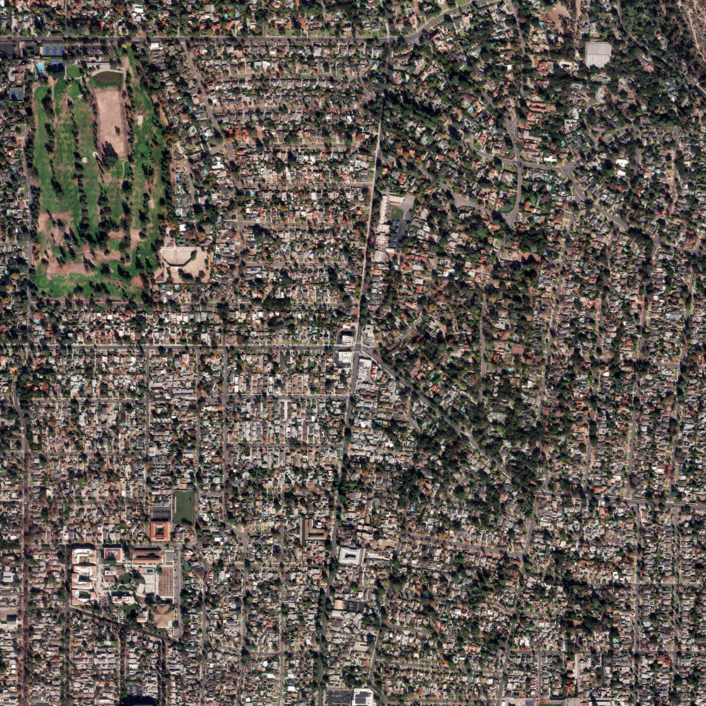

This directory represents the final sample-organized paired dataset built from the Eaton Fire attachment index.

It is not a separate fire dataset and not an unrelated unlabeled image dump. Instead, it is the attachment-level pairing workspace that links street-view images to remote-sensing crops.

Final structure:

```text
Altadena_Images/
|-- Altadena_Images/
|   |-- *.tif
|   `-- *.tif.aux.xml
|-- pre_disaster_svi.tif
|-- Eaton_Fire_attachments_index.csv
|-- Eaton_Fire_attachments_index_output/
|   |-- dataset/
|   |   `-- sample_00001/
|   |       |-- street_view.jpg
|   |       `-- remote_sensing.jpg
|   |-- triplet_dataset/
|   |   `-- sample_00001/
|   |       |-- pre_disaster_remote_sensing.jpg
|   |       |-- post_disaster_remote_sensing.jpg
|   |       `-- street_view.jpg
|   |-- dataset_index.csv
|   |-- dataset_index.xlsx
|   |-- download_report.csv
|   `-- triplet_dataset/_triplet_dataset_index.csv
|-- download_attachment_index.py
|-- match_remote_sensing.py
`-- requirements.txt
```

Final on-disk counts:

| Item | Count |
| --- | ---: |
| Sample folders | 19,780 |
| `street_view.jpg` files | 19,772 |
| `remote_sensing.jpg` files | 19,754 |
| Complete paired samples | 19,746 |
| Incomplete sample folders | 34 |
| `.tif` files | 91 |
| `.aux.xml` files | 91 |
| Pre-disaster wildfire remote-sensing mosaic | 1 local GeoTIFF |
| Valid pre/post/street-view triplets | 13,397 |

Pre-disaster remote-sensing preview:



Key notes:

- each `sample_xxxxx` folder corresponds to one attachment record from `Eaton_Fire_attachments_index.csv`
- `dataset_index.csv` is the main paired-data index
- `download_report.csv` records street-view download status
- absolute path fields inside the generated index files should be treated as provenance metadata, not portable paths
- the repository scripts currently refer to this paired dataset as the `unlabeled` split, even though source metadata such as `fire`, `category`, `objectid`, and `attachment_id` is preserved
- `pre_disaster_svi.tif` is a full-resolution local RGB GeoTIFF for the pre-disaster wildfire remote-sensing context
- source metadata observed from the local file: `50,176 x 50,176` pixels, approximately `0.305 m` resolution, WGS 84 / UTM zone 11N
- the versioned JPEG above is only a lightweight center-crop preview for documentation; the full GeoTIFF remains local
- `triplet_dataset/` combines `pre_disaster_remote_sensing.jpg`, `post_disaster_remote_sensing.jpg`, and `street_view.jpg` for samples where all three views are usable
- triplets are generated with `scripts/data_prep/build_altadena_triplet_dataset.py`; post-disaster remote-sensing and street-view files are hardlinked when possible to avoid duplicating the original images
- 6,349 otherwise complete post-disaster pairs were excluded from `triplet_dataset/` because the pre-disaster crop was empty or below the coverage threshold

Git preserves the code and folder layout here, but the full paired image dataset and raster tiles remain local and are not intended to be committed.
